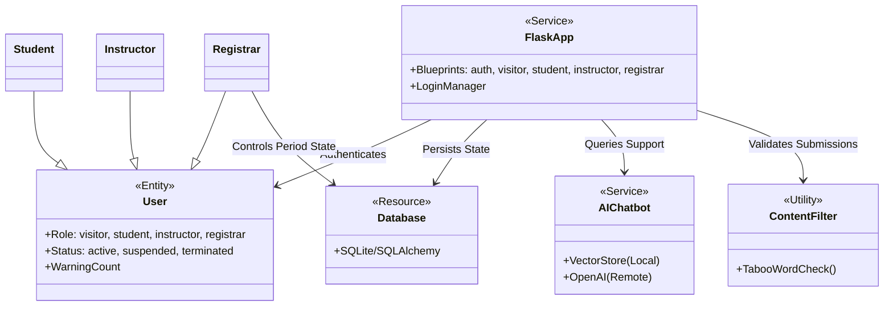
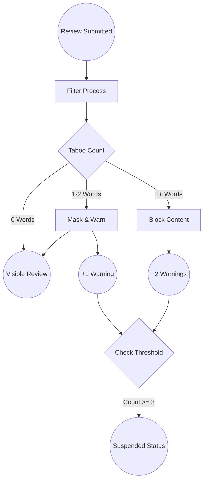
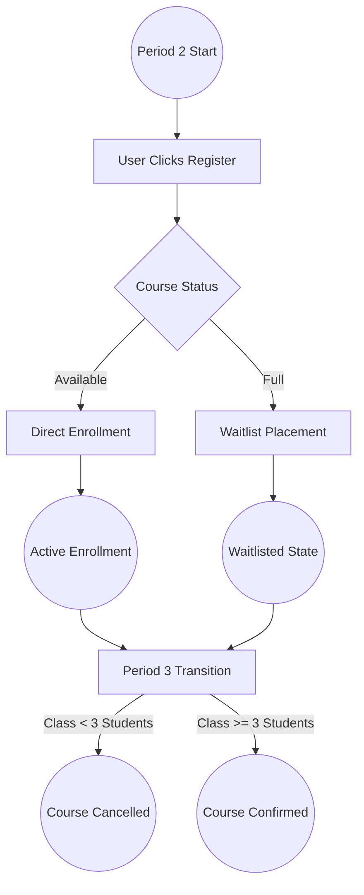
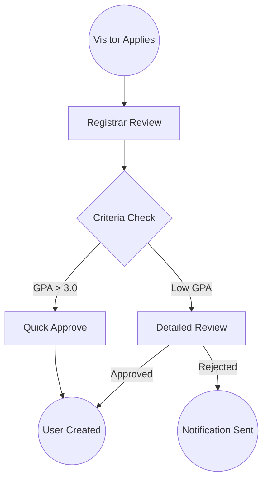

# Comprehensive System Design Report: College0 Management System

**Deadline:** April 23, 2026, 11:59 PM  
**Project Status:** Functional Prototype Ready  
**Document Version:** 1.0.0  

---

## 1. Introduction
The College0 Management System is a sophisticated educational ERP designed to handle the complex lifecycle of a graduate college. The system is built on a "Period-Driven" state machine, where the functionality available to users (registration, grading, etc.) changes dynamically based on the current academic period (1-4).

### Collaboration Class Diagram
This diagram illustrates the primary interactions between the core service components, the database, and the external AI services.



---

## 2. All Use Cases

### 2.1 Use Case: Course Registration (Student)
*   **Normal Scenario:** During Period 2, a student selects an "Open" class. The system checks their current enrollment count (< 4) and class capacity. If both pass, the student is enrolled.
*   **Exceptional Scenarios:**
    *   **Invalid Period:** Attempting registration in Periods 1, 3, or 4 results in a "Registration Closed" error.
    *   **Class Full:** If `enrollment_count >= size_limit`, the system marks the enrollment as `is_waitlisted=True`.
    *   **Over-Enrollment:** Blocking more than 4 courses to maintain academic load.

### 2.2 Use Case: Grading (Instructor)
*   **Normal Scenario:** During Period 4, an instructor accesses their class roster and assigns a letter grade.
*   **Exceptional Scenarios:**
    *   **Premature Grading:** Attempting to grade before Period 4 is reached.
    *   **Unauthorized Access:** An instructor attempting to grade a class they do not teach (RBAC failure).

### 2.3 Use Case: Application Processing (Registrar)
*   **Normal Scenario:** A registrar reviews a student application. If GPA > 3.0, the UI suggests auto-approval. The registrar approves, triggering account creation.
*   **Exceptional Scenarios:**
    *   **Manual Override:** Rejecting a high-GPA student requires a mandatory `justification` string.

### 2.4 Petri-Net Representations

#### A. Review Submission & Moderation (Petri-Net)
This represents the token flow from submission to visibility or suspension.



#### B. Course Registration Flow (Petri-Net)


#### C. Application Lifecycle (Petri-Net)


---

## 3. E-R Diagram
The following diagram defines the physical schema relationships.

```mermaid
erDiagram
    USER ||--o{ ENROLLMENT : has
    USER ||--o{ REVIEW : writes
    USER ||--o{ COMPLAINT : files
    USER ||--o{ WARNING : receives
    SEMESTER ||--o{ CLASS : contains
    INSTRUCTOR ||--o{ CLASS : teaches
    CLASS ||--o{ ENROLLMENT : contains
    CLASS ||--o{ REVIEW : receives
    APPLICATION }|--|| USER : creates
    
    USER {
        int id PK
        string name
        string email UK
        string password_hash
        string role
        string status
        int warning_count
        bool is_first_login
    }
    
    CLASS {
        int id PK
        string name
        string schedule
        int instructor_id FK
        int size_limit
        int semester_id FK
        string status
    }
    
    ENROLLMENT {
        int id PK
        int student_id FK
        int class_id FK
        string grade
        bool is_waitlisted
        bool study_buddy_opt_in
    }
    
    APPLICATION {
        int id PK
        string applicant_email
        string type
        float gpa_at_application
        string status
    }
```

---

## 4. Detailed Design: Pseudo-code for Methods

### 4.1 Global Utilities (`utils.py`)
**`filter_content(content, user_id)`**
*   **Input:** Text `content`, Integer `user_id`
*   **Logic:**
    1.  Initialize `taboo_words` from database.
    2.  Check for occurrences using Case-Insensitive Regex.
    3.  If count == 0: Return (original_content, 0).
    4.  If count in [1, 2]: Replace words with `*`, Issue 1 warning, Return (masked_content, 1).
    5.  If count >= 3: Issue 2 warnings, Return (None, 2).
*   **Output:** Tuple (Processed Content, Warning Count)

### 4.2 Auth Methods (`routes/auth.py`)
**`login()`**
*   **Logic:** Validate credentials. If `is_first_login` is True, redirect to `change_password`.

**`change_password()`**
*   **Logic:** Update `password_hash` and set `is_first_login = False`.

### 4.3 Student Methods (`routes/student.py`)
**`register()`**
*   **Logic:**
    1.  Verify Period == 2.
    2.  Check if Enrollment Count < 4.
    3.  If Class Capacity reached, set `is_waitlisted = True`.
    4.  Create `Enrollment` record.

**`study_buddy_opt_in()`**
*   **Logic:** Toggle `study_buddy_opt_in` boolean for a specific Enrollment.

**`review()`**
*   **Logic:** Call `filter_content`. If Instructor's Class Avg Rating drops < 2.0, issue Warning to Instructor.

### 4.4 Instructor Methods (`routes/instructor.py`)
**`grade()`**
*   **Logic:** Verify Period == 4. Update `Enrollment.grade`.

### 4.5 Registrar Methods (`routes/registrar.py`)
**`next_period()`**
*   **Logic:**
    1.  If moving to P3: Cancel classes with < 3 students; warn Instructor; warn Students with < 2 classes.
    2.  If moving to P4: Close all registration (`Class.status = 'closed'`).

**`process_application()`**
*   **Logic:** If `action == 'approve'`, create `User` and generate `temp_password`.

---

## 5. System Screens

### 5.1 Major GUI Screens
1.  **Dynamic Dashboard:** Varies by role. Students see "Study Buddy" matches; Instructors see "Class Management"; Registrars see "System Stats".
2.  **Period Control Panel:** (Registrar Only) Single-button interface to advance the academic cycle.
3.  **Application Processing Queue:** Color-coded list (Green for GPA > 3.0, Yellow for pending).
4.  **AI Support Sidebar:** Persistent chat widget using RAG (Retrieval-Augmented Generation).

### 5.2 Prototype Walkthrough: Registration
1.  **Trigger:** Student enters "Register" tab during Period 2.
2.  **Display:** Filtered list of "Open" classes for the current semester.
3.  **Action:** Student clicks "Add Course".
4.  **Response:** Success toast or "Waitlist" alert if full.

---

## 6. Memos & Concerns
*   **Memo (Apr 10):** Decision made to use a single `User` table with a `role` discriminator for simplicity in SQL joins.
*   **Memo (Apr 18):** Implemented "Taboo Word" filtering to automate academic discipline.
*   **Concern:** Scalability of the Vector Store for AI Chatbot as course catalog grows. Recommendation: Use FAISS for faster indexing if catalog > 1000 items.

---

## 7. Git Repository
**URL:** `https://github.com/example/college0-management`  
**Contents:**
- `app.py`: Application Factory
- `models.py`: SQLAlchemy Schema
- `ai/`: RAG Logic
- `templates/`: Jinja2 GUI

---
*End of Report*
