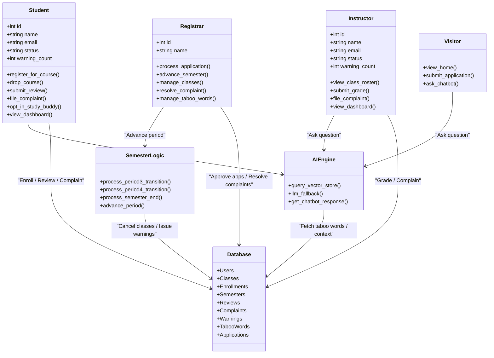
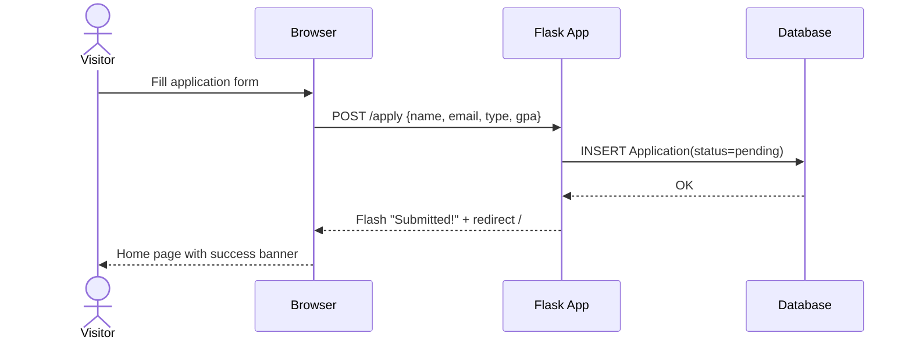
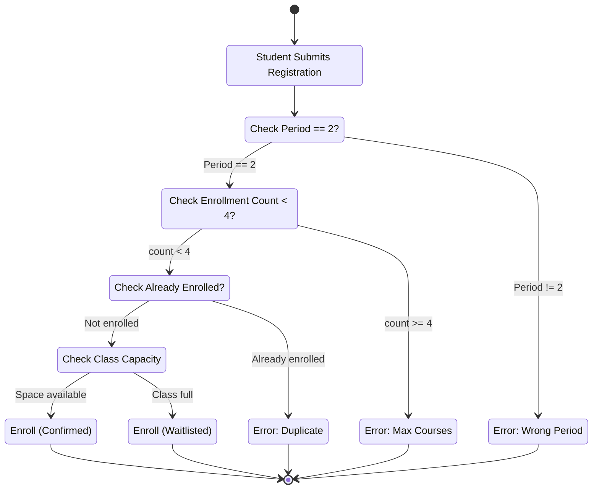
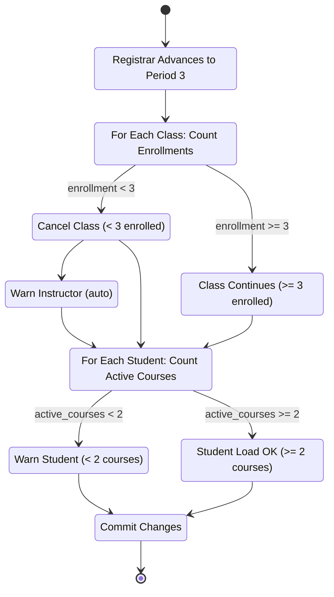
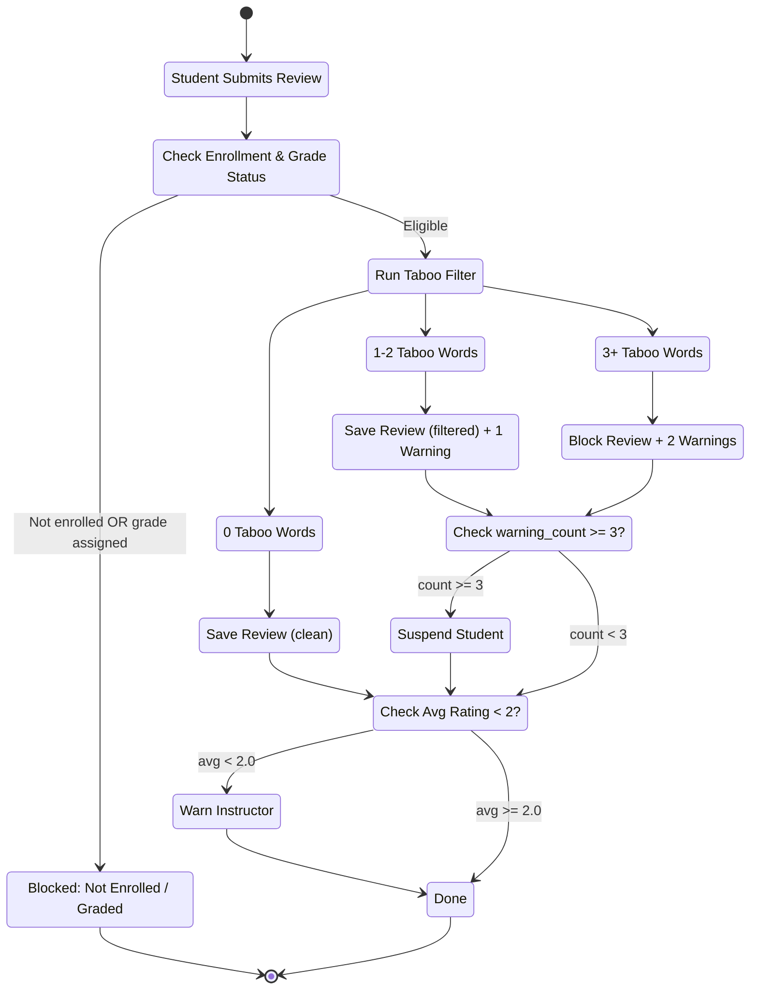
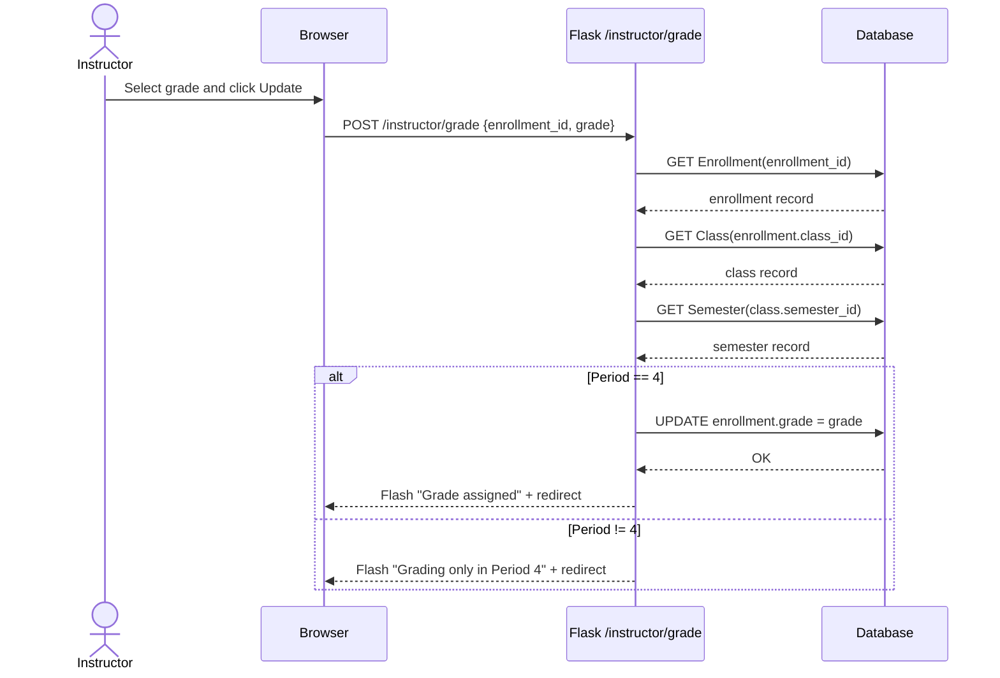

# Phase II Report — College0 College Management System

---

## 1. Introduction

**College0** is a college management system that integrates **Retrieval-Augmented Generation (RAG)** to handle institutional knowledge queries.

The system is built on a **four-tier permission model** (Visitor, Student, Instructor, Registrar) and is designed to minimize administrative overhead through automation logic, including automated course cancellations, warning escalations, and GPA-based academic standing transitions.

**Technology stack:**
- Backend: Python / Flask with SQLAlchemy (SQLite in development, PostgreSQL-ready)
- Frontend: Bootstrap 5
- Vector Store: ChromaDB
- AI Chatbot: Hybrid RAG-first, LLM-fallback strategy backed by OpenAI GPT-3.5-turbo

---

## System Collaboration Class Diagram (Mermaid)



The **Registrar** acts as the system governor, initiating all semester transitions. The **AI Engine** acts as the information broker, serving all roles. Students and Instructors are the primary data generators (enrollments, grades, reviews).

---

## 2. All Use Cases

---

### Use Case 1: Visitor Application Submission

**Actors:** Visitor  
**Preconditions:** Visitor is not authenticated. System is accepting applications.  
**Postconditions:** Application record saved; pending registrar review.

**Normal Scenario:**
1. Visitor navigates to `/apply`.
2. Visitor fills in: Full Name, Email, Applying As (Student/Instructor), GPA (if student).
3. Visitor submits form (`POST /apply`).
4. System creates Application record with `status="pending"`.
5. System flashes success message and redirects to home.

**Exceptional Scenarios:**
- **Missing required fields:** Browser-level HTML5 validation prevents submission.
- **Duplicate email:** Application is still saved; the registrar sees multiple applications from the same email and adjudicates.
- **Instructor applying with GPA field:** GPA is ignored (only relevant for students).
- **Auto-approval rule (Student, GPA > 3.0):** Registrar can still reject but must provide a written justification; the system enforces this with a flash error if the justification textarea is blank.

**Sequence Diagram (Mermaid):**



---

### Use Case 2: Registrar Processes Application

**Actors:** Registrar  
**Preconditions:** At least one Application with `status="pending"` exists.  
**Postconditions:** Application status updated; if approved, User account created.

**Normal Scenario (Approve):**
1. Registrar navigates to `/registrar/applications`.
2. Registrar clicks "Approve" on a pending application.
3. System checks GPA auto-approval rule (if student, GPA > 3.0 → auto-approve).
4. System creates new User with `role=app.type`, `is_first_login=True`.
5. System generates an 8-character random temporary password.
6. System flashes the temporary password on screen for the registrar to relay.
7. Application status set to `"accepted"`.

**Normal Scenario (Reject):**
1. Registrar clicks "Reject" on a pending application.
2. System opens a modal requiring a written justification.
3. Registrar submits justification.
4. Application status set to `"rejected"`; justification stored.

**Exceptional Scenarios:**
- **Reject with GPA > 3.0 but no justification:** System returns 400-level flash error; no state change is committed.
- **Application already processed:** "Approve/Reject" buttons are hidden; only the stored justification is shown.

---

### Use Case 3: Course Registration & Waitlisting (Petri-Net)

**Actors:** Student  
**Preconditions:** Student `status="active"`; current semester `period=2`; student not already enrolled in 4 courses this semester.  
**Postconditions:** Enrollment record created (waitlisted or confirmed).

**Normal Scenario:**
1. Student navigates to `/student/register`.
2. System validates: `period=2`, student is active, `enrolled_count < 4`.
3. Student selects a course and submits.
4. System checks: `enrolled_count` (non-waitlisted) `< class.size_limit`.
5. If space available: Enrollment created with `is_waitlisted=False`.
6. Flash: "Successfully registered for `<course>`!"

**Exceptional Scenarios:**
- **Period ≠ 2:** Flash "Registration only open in Period 2"; redirect to dashboard.
- **Already enrolled:** Flash "Already enrolled in this class."
- **4-course limit reached:** Flash "Cannot register for more than 4 courses."
- **Class full:** Enrollment created with `is_waitlisted=True`; flash "Added to waitlist."
- **Suspended student:** Recommended enhancement — check `status="active"` before allowing registration.

**Petri-Net (Mermaid stateDiagram):**



---

### Use Case 4: Period 3 "Stability Check" Transition (Petri-Net)

**Actors:** Registrar (trigger), System (automation)  
**Preconditions:** Semester is currently in Period 2.  
**Postconditions:** Period advances to 3; underpopulated classes cancelled; warnings issued.

**Normal Scenario:**
1. Registrar clicks "Next Period" on a semester in Period 2.
2. System increments `semester.current_period` to 3.
3. System iterates all classes in the semester:
   - Count non-waitlisted enrollments.
   - If `count < 3`: Set `class.status = "cancelled"`; issue warning to instructor.
   - If `count >= 3`: Class status remains "open" → transitions to "running."
4. System iterates all active students:
   - Count non-cancelled, non-waitlisted enrollments for this semester.
   - If `count < 2`: Issue warning to student.
5. All changes committed to database.

**Exceptional Scenarios:**
- **Class with no instructor assigned:** Warning generation skipped (null check).
- **Student already suspended:** Warning still issued (`warning_count` incremented).
- **All classes cancelled:** All students receive under-enrollment warnings.

**Petri-Net (Mermaid stateDiagram):**



---

### Use Case 5: Taboo Content Filtering & Warning Escalation (Petri-Net)

**Actors:** Student  
**Preconditions:** Student is enrolled in a class; no grade has been assigned yet.  
**Postconditions:** Review saved (possibly filtered) or blocked; warnings issued.

**Normal Scenario:**
1. Student opens review modal and submits stars + review text.
2. System calls `filter_content(content, user_id)`.
3. Zero taboo words found: Review saved as-is; no warning.
4. Flash "Review posted successfully!"

**Exceptional Scenarios:**
- **1–2 taboo words:** Occurrences replaced with asterisks; +1 warning to student; review saved in filtered form.
- **3+ taboo words:** Review NOT saved; +2 warnings to student; flash "Review blocked."
- **After any warning:** System checks `student.warning_count >= 3` → `status="suspended"`.
- **Post-grade review attempt:** Flash "Cannot review after grade assigned"; blocked.
- **Not enrolled:** Flash "You must be enrolled to leave a review"; blocked.
- **Instructor rating drop:** After any review, if `avg < 2.0` → warning issued to instructor.

**Petri-Net (Mermaid stateDiagram):**



---

### Use Case 6: Instructor Submits Grade

**Actors:** Instructor  
**Preconditions:** Semester is in Period 4; enrollment is not waitlisted.  
**Postconditions:** `Enrollment.grade` updated.

**Normal Scenario:**
1. Instructor navigates to `/instructor/class/<id>`.
2. Semester period check passes (`== 4`).
3. Instructor selects grade (A–F) from dropdown and clicks "Update."
4. System updates `enrollment.grade`.
5. Flash "Grade X assigned successfully."

**Exceptional Scenarios:**
- **Period != 4:** Flash "Grading only allowed during Period 4"; no change committed.
- **Instructor submitting grade for another instructor's class:** Returns HTTP 403.
- **Waitlisted student:** Grade form not shown in template; submission blocked server-side.

**Sequence Diagram (Mermaid):**



---

### Use Case 7: Registrar Resolves Complaint

**Actors:** Registrar  
**Preconditions:** A Complaint record with `status="pending"` exists.  
**Postconditions:** Complaint resolved; warning optionally issued to target or filer.

**Normal Scenario (Punish Target):**
1. Registrar navigates to `/registrar/complaints`.
2. Registrar clicks "Resolve" on a pending complaint.
3. Registrar selects `action="punish"`, writes a resolution note, submits.
4. System calls `target.add_warning(reason)`.
5. If `target.warning_count >= 3`: `target.status = "suspended"`.
6. `complaint.status = "resolved"`; resolution text saved.

**Normal Scenario (Warn Filer):**
1. Registrar selects `action="warn_filer"`.
2. System calls `filer.add_warning(reason)`.
3. Same suspension threshold check applies to filer.

**Normal Scenario (Close with No Action):**
1. Registrar selects `action="none"`.
2. Complaint closed; no warnings issued.

**Exceptional Scenarios:**
- **Target or filer account deleted:** Null check in route; graceful skip.
- **Complaint already resolved:** "Resolve" button hidden; resolution text shown.

---

### Use Case 8: AI Chatbot Query

**Actors:** Any authenticated or unauthenticated user (all roles including Visitor)  
**Preconditions:** `/chat` endpoint is available; ChromaDB is seeded.  
**Postconditions:** Answer returned to user; `is_llm` flag set appropriately.

*(See Section 5 for detailed walkthrough of this use case.)*

---

### Use Case 9: Study Buddy Opt-In & Matching

**Actors:** Student  
**Preconditions:** Student is enrolled (non-waitlisted) in at least one class.  
**Postconditions:** `Enrollment.study_buddy_opt_in` toggled; matched buddies shown on dashboard.

**Normal Scenario:**
1. From dashboard, student clicks "Find Buddy" on an enrollment card.
2. `POST /student/study-buddy-opt-in {enrollment_id}`.
3. System toggles `enrollment.study_buddy_opt_in` (False → True).
4. Dashboard refreshes; system queries for other students in same class with `study_buddy_opt_in=True` and `student_id != current_user.id`.
5. Matched names and emails shown on dashboard card.

**Exceptional Scenarios:**
- **No other opt-in students:** "No matches yet." message shown.
- **Student opts out:** `study_buddy_opt_in` set back to False; matches hidden.
- **Waitlisted student:** "Find Buddy" button not rendered in template.

---

## 3. E-R Diagram (Entire System)

```mermaid
erDiagram
    USER ||--o{ WARNING : "receives"
    USER ||--o{ ENROLLMENT : "student participates"
    USER ||--o{ CLASS : "instructor teaches"
    USER ||--o{ COMPLAINT : "files as filer"
    USER ||--o{ COMPLAINT : "is targeted by"
    USER ||--o{ REVIEW : "writes"
    USER ||--o{ APPLICATION : "represented by"
    SEMESTER ||--o{ CLASS : "contains"
    CLASS ||--o{ ENROLLMENT : "has"
    CLASS ||--o{ REVIEW : "receives"

    USER {
        int id PK
        string name
        string email UK
        string password_hash
        string role "visitor | student | instructor | registrar"
        string status "active | suspended | terminated"
        int warning_count
        bool is_first_login
    }

    APPLICATION {
        int id PK
        string applicant_email
        string applicant_name
        string type "student | instructor"
        string status "pending | accepted | rejected"
        text justification
        float gpa_at_application
    }

    SEMESTER {
        int id PK
        string name
        int current_period "1=Setup 2=Reg 3=Running 4=Grading"
    }

    CLASS {
        int id PK
        string name
        string schedule
        int instructor_id FK
        int size_limit
        int semester_id FK
        string status "setup | open | closed | cancelled"
    }

    ENROLLMENT {
        int id PK
        int student_id FK
        int class_id FK
        string grade "A | B | C | D | F | null"
        bool is_waitlisted
        bool study_buddy_opt_in
    }

    REVIEW {
        int id PK
        int student_id FK
        int class_id FK
        int stars "1-5"
        text content
        bool is_visible
    }

    COMPLAINT {
        int id PK
        int filer_id FK
        int target_id FK
        text description
        string status "pending | resolved"
        text resolution
    }

    TABOOWORD {
        int id PK
        string word UK
    }

    WARNING {
        int id PK
        int user_id FK
        text reason
        datetime timestamp
    }
```

**Key design notes:**
- `USER.role` is a discriminator column covering four distinct actor types.
- `COMPLAINT` has two FK relationships to `USER` (`filer_id`, `target_id`); both reference the same users table.
- `ENROLLMENT.is_waitlisted` distinguishes confirmed enrollments from queue entries.
- `APPLICATION` is decoupled from `USER` until approved; no FK to USER table.

---

## 4. Detailed Design: Pseudo-Code for All Methods

> All routes are implemented as Flask Blueprint endpoints. All database operations use SQLAlchemy ORM via the `db` session.

---

### 4.1 `filter_content(content, user_id)` — `utils.py`

**Input:** `content` (string), `user_id` (int)  
**Output:** `(filtered_content, warning_delta)` — `filtered_content` is `None` if review blocked; `warning_delta` is 0, 1, or 2

```
BEGIN
    taboo_words = SELECT word FROM TabooWord

    found_count = 0
    filtered_content = content

    FOR EACH word IN taboo_words:
        IF word (case-insensitive) IN content:
            found_count += 1
            filtered_content = REGEX_REPLACE(word, '***', filtered_content)

    IF found_count >= 3:
        warn = Warning(user_id, reason="Review blocked: 3+ taboo words")
        DB.ADD(warn)
        RETURN (None, 2)

    ELSE IF found_count >= 1:
        warn = Warning(user_id, reason="Review filtered: {found_count} taboo words")
        DB.ADD(warn)
        RETURN (filtered_content, 1)

    ELSE:
        RETURN (content, 0)
END
```

---

### 4.2 `User.add_warning(reason)` — `models.py`

**Input:** `self` (User), `reason` (string)  
**Output:** Side effects — DB updated, suspension triggered if threshold met

```
BEGIN
    warn = Warning(user_id=self.id, reason=reason)
    DB.ADD(warn)
    self.warning_count += 1

    IF (self.role == 'student' OR self.role == 'instructor')
       AND self.warning_count >= 3:
        self.status = 'suspended'

    DB.COMMIT()
END
```

> **Note:** Registrar role is exempt from suspension regardless of warning count.

---

### 4.3 `apply()` — `POST /apply` — `routes/visitor.py`

**Input:** `name`, `email`, `type` ('student' | 'instructor'), `gpa` (optional float)  
**Output:** Redirect to home with flash message

```
BEGIN
    new_app = Application(
        applicant_name = name,
        applicant_email = email,
        type = type,
        gpa_at_application = PARSE_FLOAT(gpa) IF gpa ELSE NULL
    )
    DB.ADD(new_app)
    DB.COMMIT()
    FLASH("Application submitted successfully!", "success")
    REDIRECT to visitor.home
END
```

---

### 4.4 `process_application(app_id, action)` — `routes/registrar.py`

**Input:** `app_id` (int), `action` ('approve' | 'reject'), `justification` (string)  
**Output:** Redirect to applications list with flash message

```
BEGIN
    app = GET Application(app_id)  // 404 if not found

    IF app.type == 'student'
       AND app.gpa_at_application > 3.0
       AND action == 'reject'
       AND justification IS EMPTY:
        FLASH("Justification required to override auto-approval", "danger")
        REDIRECT to registrar.applications

    IF action == 'approve':
        app.status = 'accepted'
        temp_pass = GENERATE_RANDOM_PASSWORD(length=8)
        new_user = User(
            name  = app.applicant_name,
            email = app.applicant_email,
            role  = app.type,
            is_first_login = True
        )
        new_user.SET_PASSWORD(temp_pass)
        DB.ADD(new_user)
        FLASH("Approved! Temp password: {temp_pass}", "success")

    ELSE:  // reject
        app.status = 'rejected'
        app.justification = justification
        FLASH("Application rejected.", "info")

    DB.COMMIT()
    REDIRECT to registrar.applications
END
```

---

### 4.5 `register()` — `GET/POST /student/register` — `routes/student.py`

**Input (POST):** `class_id` (int)  
**Output:** GET renders registration page; POST redirects with flash

```
BEGIN
    current_sem = GET Semester WHERE current_period <= 2 ORDER BY id DESC LIMIT 1

    IF current_sem IS NULL OR current_sem.current_period != 2:
        FLASH("Registration only open during Period 2.", "warning")
        REDIRECT to student.dashboard

    IF request.method == 'POST':
        cls = GET Class(class_id)  // 404 if not found

        existing = GET Enrollment WHERE student_id=current_user.id AND class_id=cls.id
        IF existing EXISTS:
            FLASH("Already enrolled.", "info")
            REDIRECT to student.register

        current_count = COUNT Enrollments WHERE student_id=current_user.id
                        AND Class.semester_id == current_sem.id
        IF current_count >= 4:
            FLASH("Cannot register for more than 4 courses.", "danger")
            REDIRECT to student.register

        enrolled_count = COUNT Enrollments WHERE class_id=cls.id AND is_waitlisted=False
        is_waitlisted = (enrolled_count >= cls.size_limit)

        new_enrollment = Enrollment(
            student_id   = current_user.id,
            class_id     = cls.id,
            is_waitlisted = is_waitlisted
        )
        DB.ADD(new_enrollment)
        DB.COMMIT()

        IF is_waitlisted:
            FLASH("Class full. Added to waitlist.", "warning")
        ELSE:
            FLASH("Successfully registered for {cls.name}!", "success")

        REDIRECT to student.dashboard

    // GET
    available_classes = GET Classes WHERE semester_id=current_sem.id AND status='open'
    RENDER student/register.html WITH classes=available_classes
END
```

---

### 4.6 `review()` — `POST /student/review` — `routes/student.py`

**Input:** `class_id` (int), `stars` (int 1–5), `content` (string)  
**Output:** Redirect to `student.dashboard` with flash message

```
BEGIN
    enrollment = GET Enrollment WHERE student_id=current_user.id AND class_id=class_id
    IF enrollment IS NULL:
        FLASH("Must be enrolled to review.", "danger")
        REDIRECT to student.dashboard

    IF enrollment.grade IS NOT NULL:
        FLASH("Cannot review after grade assigned.", "warning")
        REDIRECT to student.dashboard

    filtered_content, warning_delta = filter_content(content, current_user.id)
    current_user.warning_count += warning_delta

    IF filtered_content IS NULL:
        DB.COMMIT()
        FLASH("Review blocked: too many taboo words. +2 warnings.", "danger")
        REDIRECT to student.dashboard

    new_review = Review(
        student_id = current_user.id,
        class_id   = class_id,
        stars      = stars,
        content    = filtered_content,
        is_visible = True
    )
    DB.ADD(new_review)
    DB.COMMIT()

    IF warning_delta > 0:
        FLASH("Review posted with filters. +{warning_delta} warning(s).", "warning")
    ELSE:
        FLASH("Review posted successfully!", "success")

    avg_rating = SELECT AVG(stars) FROM Review WHERE class_id=class_id
    IF avg_rating < 2.0:
        instructor = GET User(cls.instructor_id)
        IF instructor IS NOT NULL:
            warn = Warning(user_id=instructor.id,
                           reason="Avg rating for '{cls.name}' below 2.")
            instructor.warning_count += 1
            DB.ADD(warn)
            DB.COMMIT()

    REDIRECT to student.dashboard
END
```

---

### 4.7 `grade()` — `POST /instructor/grade` — `routes/instructor.py`

**Input:** `enrollment_id` (int), `grade` (string: A | B | C | D | F)  
**Output:** Redirect to `instructor.class_detail` with flash message

```
BEGIN
    enrollment = GET Enrollment(enrollment_id)  // 404 if missing
    cls = GET Class(enrollment.class_id)

    IF cls.instructor_id != current_user.id:
        RETURN HTTP 403

    sem = GET Semester(cls.semester_id)

    IF sem.current_period != 4:
        FLASH("Grading only allowed in Period 4.", "danger")
        REDIRECT to instructor.class_detail(cls.id)

    enrollment.grade = grade
    DB.COMMIT()
    FLASH("Grade {grade} assigned.", "success")
    REDIRECT to instructor.class_detail(cls.id)
END
```

---

### 4.8 `next_period(sem_id)` — `POST /registrar/semesters/<sem_id>/next_period` — `routes/registrar.py`

**Input:** `sem_id` (int)  
**Output:** Redirect to `registrar.semesters` with flash message

```
BEGIN
    sem = GET Semester(sem_id)  // 404 if missing

    IF sem.current_period < 4:
        sem.current_period += 1

        IF sem.current_period == 3:
            CALL process_period_3_transition(sem)

        IF sem.current_period == 4:
            classes = GET Classes WHERE semester_id=sem.id
            FOR EACH c IN classes:
                IF c.status == 'open':
                    c.status = 'closed'

        DB.COMMIT()
        FLASH("Moved to Period {sem.current_period} for {sem.name}", "success")

    ELSE:  // Period was 4 → finalize
        CALL process_semester_end(sem)
        FLASH("Semester {sem.name} finalized.", "success")

    REDIRECT to registrar.semesters
END
```

---

### 4.9 `process_period_3_transition(sem)` — `routes/registrar.py`

**Input:** `sem` (Semester)  
**Output:** Side effects — classes cancelled, warnings issued, DB updated

```
BEGIN
    classes = GET Classes WHERE semester_id=sem.id

    // Phase A: Class viability check
    FOR EACH c IN classes:
        enrollment_count = COUNT Enrollments
                           WHERE class_id=c.id AND is_waitlisted=False
        IF enrollment_count < 3:
            c.status = 'cancelled'
            instructor = GET User(c.instructor_id)
            IF instructor IS NOT NULL:
                warn = Warning(user_id=instructor.id,
                               reason="Course '{c.name}' cancelled: < 3 enrolled.")
                instructor.warning_count += 1
                DB.ADD(warn)

    // Phase B: Student load check
    students = GET Users WHERE role='student' AND status='active'

    FOR EACH s IN students:
        active_count = COUNT Enrollments
                       WHERE student_id=s.id
                         AND Class.semester_id=sem.id
                         AND Class.status != 'cancelled'
                         AND Enrollment.is_waitlisted=False
        IF active_count < 2:
            warn = Warning(user_id=s.id,
                           reason="Fewer than 2 active courses in {sem.name}.")
            s.warning_count += 1
            DB.ADD(warn)
    // Caller commits DB
END
```

---

### 4.10 `process_semester_end(sem)` — `routes/registrar.py`

**Input:** `sem` (Semester being finalized)  
**Output:** Side effects — student academic standing updated

```
BEGIN
    GRADE_MAP = {A: 4.0, B: 3.0, C: 2.0, D: 1.0, F: 0.0}

    students = GET Users WHERE role='student'

    FOR EACH student IN students:
        graded_enrollments = GET Enrollments
                             WHERE student_id=student.id
                               AND grade IS NOT NULL

        IF graded_enrollments IS EMPTY:
            CONTINUE

        total_points = SUM(GRADE_MAP[e.grade] FOR e IN graded_enrollments)
        course_count  = COUNT(graded_enrollments)
        semester_gpa  = total_points / course_count

        total_credits = COUNT ALL Enrollments
                        WHERE student_id=student.id
                          AND grade IS NOT NULL
                          AND grade != 'F'

        IF semester_gpa < 2.0:
            student.status = 'terminated'
            LOG "Student #{student.id} terminated: GPA {semester_gpa} < 2.0"

        ELSE IF total_credits >= 8 AND semester_gpa >= 3.0:
            student.status = 'graduated'
            LOG "Student #{student.id} graduated: credits={total_credits}"

    sem.current_period = 5  // mark archived
    DB.COMMIT()
END
```

---

### 4.11 `complaints()` — `POST /registrar/complaints` — `routes/registrar.py`

**Input:** `comp_id` (int), `action` ('punish' | 'warn_filer' | 'none'), `resolution` (string)  
**Output:** Redirect to `registrar.complaints` with flash message

```
BEGIN
    comp = GET Complaint(comp_id)
    comp.status     = 'resolved'
    comp.resolution = resolution

    IF action == 'punish':
        target = GET User(comp.target_id)
        IF target IS NOT NULL:
            target.ADD_WARNING("Warning from complaint #{comp.id}: {resolution}")
            FLASH("Warning issued to user #{target.id}", "success")

    ELSE IF action == 'warn_filer':
        filer = GET User(comp.filer_id)
        IF filer IS NOT NULL:
            filer.ADD_WARNING("False complaint #{comp.id}: {resolution}")
            FLASH("Warning issued to filer #{filer.id}", "warning")

    ELSE:  // 'none'
        FLASH("Complaint #{comp.id} closed with no action.", "info")

    DB.COMMIT()
    REDIRECT to registrar.complaints
END
```

---

### 4.12 `get_chatbot_response(user_input, user_role)` — `ai/chatbot.py`

**Input:** `user_input` (string), `user_role` (string)  
**Output:** `(answer: string, is_llm: bool)`

```
BEGIN
    // Step 1: Vector Store lookup (RAG)
    vector_answer = query_vector_store(user_input, user_role)

    IF vector_answer IS NOT NULL:
        RETURN (vector_answer, False)

    // Step 2: LLM Fallback
    api_key = GET ENV("OPENAI_API_KEY")

    IF api_key IS NULL OR api_key == "your-api-key-here":
        RETURN ("LLM not configured. Please contact admin.", False)

    TRY:
        client = OpenAI(api_key=api_key)
        response = client.chat.completions.create(
            model    = "gpt-3.5-turbo",
            messages = [
                {role: "system",
                 content: "You are an AI assistant for College0. User role: {user_role}"},
                {role: "user", content: user_input}
            ],
            max_tokens = 150
        )
        RETURN (response.choices[0].message.content, True)

    CATCH Exception as e:
        LOG("LLM Error: {e}")
        RETURN ("I'm having trouble connecting. Please try again.", False)
END
```

---

### 4.13 `query_vector_store(query_text, user_role)` — `ai/vector_store.py`

**Input:** `query_text` (string), `user_role` (string)  
**Output:** `answer` (string | None)

```
BEGIN
    results = chromadb_collection.query(
        query_texts = [query_text],
        n_results   = 1
    )

    IF results['documents'] IS NOT EMPTY
       AND results['distances'][0][0] < 0.5:  // Similarity threshold
        RETURN results['documents'][0][0]

    RETURN None
END
```

> **Future enhancement:** Filter by `metadata.role == user_role` to restrict sensitive institutional rules to appropriate roles.

---

### 4.14 `study_buddy_opt_in()` — `POST /student/study-buddy-opt-in` — `routes/student.py`

**Input:** `enrollment_id` (int)  
**Output:** Redirect to `student.dashboard` with flash message

```
BEGIN
    enrollment = GET Enrollment(enrollment_id)  // 404 if missing

    IF enrollment.student_id != current_user.id:
        RETURN HTTP 403

    enrollment.study_buddy_opt_in = NOT enrollment.study_buddy_opt_in
    DB.COMMIT()

    status = "opted in" IF enrollment.study_buddy_opt_in ELSE "opted out"
    FLASH("Successfully {status} for Study Buddy matching.", "success")
    REDIRECT to student.dashboard
END
```

**Dashboard query for matches (GET /student/dashboard):**

```
BEGIN
    FOR EACH enrollment IN student_enrollments:
        IF enrollment.study_buddy_opt_in == True:
            buddies = GET Users
                      JOIN Enrollments ON User.id = Enrollment.student_id
                      WHERE Enrollment.class_id     = enrollment.class_id
                        AND Enrollment.study_buddy_opt_in = True
                        AND Enrollment.student_id  != current_user.id
        ELSE:
            buddies = []
END
```


### 5.2 Functional Prototype: AI Chatbot — User Interaction Walkthrough

**Overview:** The AI chatbot is a persistent floating widget (bottom-right of all pages) powered by a hybrid RAG + LLM fallback architecture. Any user — including unauthenticated visitors — can interact with it.

**Components:**
- **Frontend:** Bootstrap-styled chatbot widget in `base.html`; AJAX `POST` to `/chat`.
- **Backend endpoint:** `POST /chat` in `app.py`.
- **AI layer:** `ai/chatbot.py` → `ai/vector_store.py` (ChromaDB) → OpenAI GPT-3.5-turbo.

**Seeded Knowledge Base (ChromaDB "college0_info" collection):**

| ID     | Rule                                                                 | Role       |
|--------|----------------------------------------------------------------------|------------|
| rule_1 | Students must register for 2 to 4 courses per semester.              | all        |
| rule_2 | GPA below 2.0 results in automatic termination.                      | student    |
| rule_3 | A student receives a warning for reviews containing taboo words.     | student    |
| rule_4 | Instructors are suspended if they accumulate 3 warnings.             | instructor |
| rule_5 | Courses with fewer than 3 enrolled students are cancelled in Period 3.| all       |
| grad_1 | Students who complete 8 courses can apply for graduation.            | student    |

**Scenario A — Visitor asks a general policy question:**
- User types: "How many courses do students need to graduate?"
- Role = `visitor` (unauthenticated).
- `query_vector_store()` matches `grad_1` with distance < 0.5.
- RAG answer returned: "Students who complete 8 courses can apply for graduation."
- `is_llm = False` → no disclaimer shown.

**Scenario B — Student asks a role-specific question:**
- Logged-in student types: "What happens if my GPA drops below 2.0?"
- Vector store finds `rule_2` with high similarity.
- Student receives: "GPA below 2.0 results in automatic termination."

**Scenario C — Query not in vector store (LLM fallback triggered):**
- Student types: "Can I appeal a course cancellation decision?"
- Vector store returns no document within the 0.5 distance threshold.
- OpenAI GPT-3.5-turbo invoked with system prompt: `"You are an AI assistant for College0. User role: student."`
- `is_llm = True` → frontend appends red disclaimer: *"Answer generated by LLM — may contain inaccuracies."*

**Scenario D — LLM not configured:**
- `OPENAI_API_KEY` not set or is placeholder.
- Fallback message: "I'm sorry, my LLM brain is not configured with an API key yet."

**Scenario E — Instructor asks about warning rules:**
- Instructor types: "How many warnings before suspension?"
- `rule_4` matches: "Instructors are suspended if they accumulate 3 warnings."
- Served via RAG; `is_llm = False`.

**Design Notes:**
- The chatbot widget is always visible and collapsible via the "\_" button.
- Chat history is session-local (in-DOM); not persisted across page loads.
- The `/chat` endpoint is POST-only; CSRF protection recommended for production.
- ChromaDB collection persists to disk at `ai/chroma_db/` between restarts.
- Future improvement: filter ChromaDB query by `metadata.role` for role-restricted policy documents.

---


## 6. Group Memos & Concerns

### Meeting Memos
**Date:** April 23, 2026 |
**Agenda:** Consolidated review of Phase I → II transition, AI integration, and final code audit.

**Decisions:**
* **Tech Stack:** Finalized Flask, SQLAlchemy, and Bootstrap 5. Development will use SQLite (serialized mode) with a planned migration to PostgreSQL for production.
* **User & Logic:** Confirmed a four-tier user model. Enforced server-side checks for grade submissions and automated warnings for student under-enrollment (< 2 courses).
* **Enrollment Edge Cases:** Waitlisted students will receive notifications upon class cancellation but will not be auto-shuffled into other sections.
* **AI & RAG Implementation:** Integrated **ChromaDB** using local sentence-transformer embeddings to eliminate external API costs for vector searches. A distance threshold of 0.5 is set for RAG hits; **GPT-3.5-turbo** serves as the fallback with a mandatory disclaimer.
* **Immediate Fixes:** Identified and scheduled a fix for a missing `@app.route` decorator on the student registration endpoint.

---

### Concerns
* **Stability & Security:** The lack of CSRF protection and the current "flash message" delivery of temporary passwords present security risks that must be addressed via Flask-WTF and Flask-Mail in the next phase.
* **Concurrency Issues:** There is a risk of race conditions for the "last seat" in a class. While SQLite provides basic protection, explicit database row-locking or PostgreSQL transactions are flagged for Phase III.
* **Unfinished Dynamic Features:** Several UI elements—specifically GPA calculations, the "Top Students" widget, and the Registrar’s Taboo Word management—remain hardcoded or stubs. These are prioritized for implementation in Phase III.
* **API Sustainability:** While RAG minimizes LLM calls, potential OpenAI rate limits remain a concern. Transitioning to a local model (e.g., Ollama) is being explored to eliminate external dependencies.


---

## 7. Git Repository Address

**GitHub Repository:** `www.github.com/pragyamtiwari/college0`
